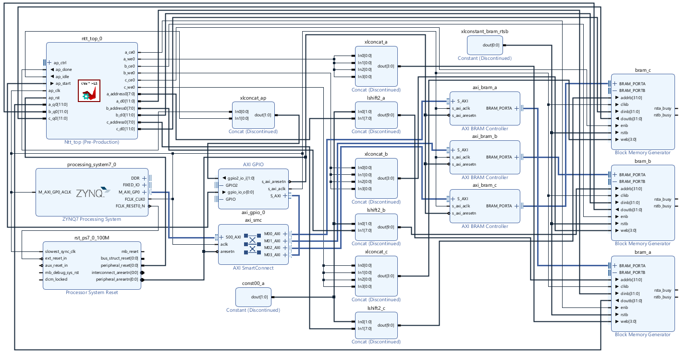

# Kyber NTT Hardware Accelerator

Hardware accelerator for negacyclic polynomial multiplication in ℤ_q[x]/(x^n+1) — the core
arithmetic primitive of CRYSTALS-Kyber (FIPS 203 / ML-KEM). Implemented in Vitis HLS, integrated
via Vivado block design, and deployed on a PYNQ-Z2 (Zynq-7000 SoC).

The full Kyber KEM protocol runs on the ARM PS; every polynomial multiply is offloaded to the PL
via memory-mapped BRAM using `/dev/mem` and a C binary.

**[Live demo notebook →](ps/kyber_demo.ipynb)** : benchmarks, correctness proofs, and a
complete hardware-accelerated Kyber-512 key exchange with charts.

---

## Results

| Metric | Value |
|---|---|
| End-to-end compute (NTT(a) ∥ NTT(b) → mul → INTT) | **7,569–8,589 cycles** |
| Latency @ 100 MHz (measured, ap_start → ap_idle) | **~133 µs** |
| Per-multiply speedup vs ARM Cortex-A9 Python | **412×** |
| End-to-end Kyber-512 KEM speedup | **3.1×** (301 ms vs 923 ms, 12 multiplications) |
| Timing closure (WNS) | 0.204 ns @ 100 MHz |
| LUT utilization | 7,140 / 53,200 (13%) |
| FF utilization | 7,364 / 106,400 (7%) |
| DSP utilization | 33 / 220 (15%) |
| BRAM tiles | 6 / 140 (4%) |
| Pipeline II (NTT butterfly loop) | 4 (floor set by single-port BRAM: 4 accesses, 1 port) |

HLS auto-parallelizes NTT(a) and NTT(b) into two hardware instances, so total latency is
`max(NTT_a, NTT_b) + mul_ntt + INTT` rather than three sequential calls.

---

## Architecture



```
PS (ARM Cortex-A9, Linux)          PL (FPGA Fabric)
──────────────────────────         ─────────────────────────────────────
                                   ┌─────────────────────────────────┐
  /dev/mem + mmap()                │  ntt_top HLS IP (ap_ctrl_hs)    │
                                   │  ┌──────────┐  ┌─────────────┐  │
  write a[] → BRAM A ─Port A──────►│  │ntt_engine│  │ntt_engine   │  │
  write b[] → BRAM B ─Port A──────►│  │  NTT(a)  │  │  NTT(b)     │  │
                                   │  └────┬─────┘  └──────┬──────┘  │
  GPIO: pulse ap_start             │       └───────┬────────┘        │
  GPIO: poll ap_idle  ◄────────────│           mul_ntt               │
                                   │           INTT(c)               │
  read c[] ← BRAM C ──Port A──────◄│                                 │
                                   └─────────────────────────────────┘
       │                                    │ Port B (HLS)
       ▼                                    ▼
  AXI BRAM Controllers              True Dual-Port BRAMs (A, B, C)
  AXI GPIO                          256 × 32-bit each (12-bit coefficients)
  SmartConnect (GP0)
```

### Hardware / Software Boundary

| Layer | Language | Responsibility |
|---|---|---|
| HLS | Vitis HLS (C++) | All arithmetic: Barrett mul, CT/GS butterfly, slot multiply, sequencing |
| Block design | Vivado TCL | BRAM wiring, AXI interconnect, GPIO, PS config |
| PS driver | C | `/dev/mem` BRAM access, GPIO control, Kyber KEM protocol |

Control is routed through AXI GPIO rather than `s_axilite` because `ap_ctrl_hs` exposes
`ap_idle` as a real hardware pin, enabling BRAM port arbitration (PS owns BRAMs while HLS is
idle) with no additional mux logic.

### Address Map

| Peripheral | Base | Range |
|---|---|---|
| BRAM A (polynomial a) | `0x40000000` | 8K |
| BRAM B (polynomial b) | `0x40002000` | 8K |
| BRAM C (result c) | `0x40004000` | 8K |
| AXI GPIO (ap_start / ap_idle) | `0x40010000` | 64K |

---

## Verification

Four independent layers, each checking against the Python golden model:

| Stage | Tool | Result |
|---|---|---|
| Golden model | Python (`golden/kyber_ntt.py`) | **13/13 tests pass** - Barrett, butterflies, roundtrip, poly_mul vs schoolbook |
| HLS C-simulation | Vitis HLS (`hls/tb/tb_ntt_top.cpp`) | **All vectors pass** - full pipeline checked against golden model before synthesis |
| RTL simulation | Cocotb + Icarus Verilog (`sim/test_ntt_top.py`) | **64/64 vectors pass** - HLS-generated Verilog with Python BRAM models (`sim/results.xml`) |
| Hardware | C driver (`ps/ntt_driver.c`) | **Pass** - coefficient-by-coefficient match against golden model on PYNQ-Z2; 133 µs measured |

---

## Quick Start

### Full build (Windows, Vitis HLS 2025.1 + Vivado 2025.1 + WSL required)

```bash
make all        # golden model → HLS C-sim → HLS synthesis → RTL sim → Vivado impl → export
make help       # list individual targets
```

### Step by step

**1. Golden model — runs anywhere, no tools required:**
```bash
make golden     # 13 unit tests, dev params (n=4, q=17)
make golden-kyber  # same tests with full Kyber params (n=256, q=3329)
```

**2. HLS C-simulation — requires Vitis HLS 2025.1:**
```bash
make hls-csim   # full pipeline tb_ntt_top against golden test vectors
```

**3. RTL simulation — requires WSL with Icarus Verilog and cocotb:**
```bash
make sim                          # 64 vectors, ~6 min
make sim NTT_MAX_VECTORS=3        # quick smoke test
make sim NTT_MAX_VECTORS=1 WAVES=1  # single vector + VCD waveform (open with GTKWave)
```

**4. HLS synthesis + Vivado implementation — requires Vitis HLS 2025.1 + Vivado 2025.1:**
```bash
make bitstream   # hls-synth → vivado-impl → export (exports to bitstream/)
```
To recreate only the block design TCL (not re-synthesize): `source vivado/ntt_bd.tcl` in the Vivado Tcl console.

**5. Hardware — PYNQ-Z2 only:**
```bash
# Copy bitstream/ntt_bd.bit and bitstream/ntt_bd.hwh to the board, then:
cd ps && make
sudo ./ntt_driver -t                               # latency benchmark
```
Or open `ps/kyber_demo.ipynb` on the board for the full benchmarked demo.

### Retarget to any (N, Q)

```bash
python scripts/gen_twiddle_rom.py --n 256 --q 3329   # full Kyber
python scripts/gen_twiddle_rom.py --n 4   --q 17     # dev params
# then re-run: make hls-csim hls-synth sim vivado-impl export
```

---

## Repository Structure

| Path | Contents |
|---|---|
| `golden/` | Python reference implementation — source of truth for all verification |
| `hls/src/` | Vitis HLS C++ source: `barrett`, `ntt_engine`, `mul_ntt`, `ntt_top` |
| `hls/tb/` | HLS C-simulation testbench |
| `sim/` | Cocotb RTL testbench and Makefile |
| `ps/` | C driver, Kyber KEM protocol, Jupyter demo notebook |
| `vivado/ntt_bd.tcl` | Block design recreation script (full design from scratch) |
| `bitstream/` | Synthesized `.bit` and `.hwh` for PYNQ-Z2 |
| `scripts/` | Twiddle ROM generator, HLS launcher, bitstream export |
| `docs/` | Math derivation, architecture plan, module interfaces |

### Documentation

- [`docs/mathematic_derivation.md`](docs/mathematic_derivation.md) — NTT theory, CT/GS butterfly equations, Barrett reduction, twist proof, Kyber-native factorisation and base-case multiply derivation
- [`docs/detailed_plan.md`](docs/detailed_plan.md) — module interfaces, pragma strategy, milestone tracking

---

## Design Notes

**Parametric architecture.** Dev parameters (n=4, q=17) and full Kyber (n=256, q=3329) share
one RTL netlist. `scripts/gen_twiddle_rom.py` regenerates all constants atomically.

**Pipeline depth.** The NTT butterfly achieves II=4, which is the hard floor for a single-port
BRAM interface (2 reads + 2 writes per butterfly, 1 port). A bit-reversed memory layout would
allow II=1 and ~3–4× speedup.

**Direct BRAM access.** Coefficient arrays live in on-chip BRAM. The PS reads and writes
directly through AXI BRAM Controllers (no DMA, no cache flush, no PYNQ overlay required).
